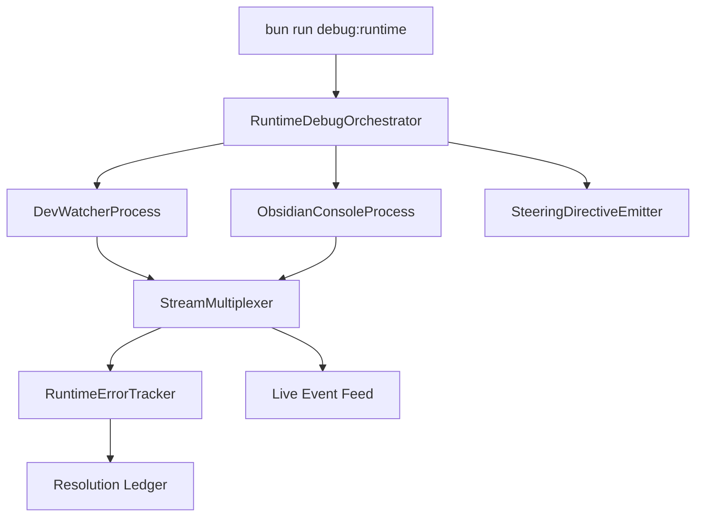

# Design Document

## Overview

This design establishes a `bun run debug:runtime` orchestration that boots the Bun watch build and an Obsidian console stream in parallel, exposes their outputs to the AI agent in real time, and manages an error tracking state so the agent can iteratively diagnose runtime issues without blocking terminals. The workflow layers on existing automation utilities referenced in `.codex/steering/tech.md` and `.codex/steering/structure.md`, keeping new logic under `automation/` while relying on Bun-native process management.

## Architecture

- A Bun entry point (`automation/dev/runtimeDebug.ts`) is registered under the new `debug:runtime` script in `package.json`.
- The entry point constructs a `RuntimeDebugOrchestrator` that spins up two long-lived subprocesses:
  - `DevWatcherProcess` wraps `bun run dev` with streaming stdout/stderr.
  - `ObsidianConsoleProcess` launches (or attaches to) Obsidian with remote debugging flags, opens `bases-preview.base`, and mirrors console events.
- A shared `StreamMultiplexer` consumes both subprocess streams, normalizes events, and publishes them over an in-memory event bus.
- A `RuntimeErrorTracker` subscribes to the bus, deduplicates errors, and persists state snapshots for the AI agent.
- A `SteeringDirectiveEmitter` surfaces workflow instructions (entry commands, hotkeys, observable streams) for the agent when the orchestrator boots.



## Components and Interfaces

- `automation/dev/runtimeDebug.ts`
  - Exports `main(): Promise<void>` that constructs `RuntimeDebugOrchestrator` and handles top-level signal handling.
  - Uses `automation/utils/shellUtils.ts` helpers for consistent logging when spawning child processes.
- `automation/dev/RuntimeDebugOrchestrator.ts`
  - Constructor receives `DevWatcherProcess`, `ObsidianConsoleProcess`, `StreamMultiplexer`, `RuntimeErrorTracker`, and `SteeringDirectiveEmitter` instances.
  - `start()` starts processes concurrently (no awaited blocking), registers listeners, and emits readiness events (Requirement 1.1–1.3).
  - `stop(reason)` gracefully terminates subprocesses on SIGINT/SIGTERM.
- `automation/dev/processes/DevWatcherProcess.ts`
  - Wraps `Bun.spawn` to execute `bun run dev` (Requirement 2.1).
  - Exposes async generator `streamLines(): AsyncIterable<StreamEvent>` so consumers can iterate without awaiting process exit (Requirement 4.1).
  - Detects compilation errors by scanning output lines via regex patterns targeting Vite/Bun watcher diagnostics; publishes `CompilationErrorEvent` within five seconds (Requirement 2.2).
- `automation/dev/processes/ObsidianConsoleProcess.ts`
  - Launches Obsidian via `open -a Obsidian --args --devtools --remote-debugging-port=39200` on macOS or platform-specific equivalents.
  - Uses the Chrome DevTools Protocol through `chrome-remote-interface` to connect to the exposed WebSocket, subscribe to `Runtime.consoleAPICalled` and `Log.entryAdded`, and forward payloads to the multiplexer (Requirement 3.1–3.2).
  - Checks for existing Obsidian instances; if detected, attaches to the active session instead of relaunching (Requirement 3.3).
  - Sends the `bases-preview.base` focus command using Obsidian URI scheme (`obsidian://open?file=bases-preview.base`) after the connection is ready.
- `automation/dev/StreamMultiplexer.ts`
  - Normalizes process output into `StreamEvent` discriminated unions (`build-log`, `build-error`, `runtime-log`, `runtime-error`).
  - Publishes over a typed `EventEmitter` that supports multiple subscribers including the AI agent transport and error tracker.
  - Ensures backpressure by buffering with a bounded queue and dropping oldest info-level lines when saturated to keep errors prioritized (Requirement 4.2).
- `automation/dev/RuntimeErrorTracker.ts`
  - Maintains a map of active `ErrorContext` objects keyed by origin and signature (Requirement 5.1–5.2).
  - Acknowledge API `markResolved(contextId: string, note: string)` updates status, timestamps resolution, and emits ledger updates (Requirement 5.3).
  - Persists snapshots to `.codex/tmp/runtime-debug-state.json` for agent persistence between runs.
- `automation/dev/SteeringDirectiveEmitter.ts`
  - Reads a dedicated steering markdown (`.codex/steering/runtime-debugging.md`) and outputs summarized directives to stdout when orchestration starts (Requirement 1.3).
  - Provides the AI agent with command references, event stream endpoints, and resolution workflow instructions.
- Agent integration
  - Expose the event bus over a local WebSocket server (`ws://127.0.0.1:48321`) so the AI agent client can subscribe without polling.
  - Provide a CLI `--interactive` flag that drops into a REPL powered by `RuntimeDebugSession` for manual inspection when a human operator runs the command.

## Data Models

- `StreamEvent`
  ```ts
  type StreamEvent =
    | { source: 'build'; level: 'info' | 'warn' | 'error'; timestamp: number; message: string }
    | { source: 'runtime'; level: 'info' | 'warn' | 'error'; timestamp: number; message: string; origin?: string };
  ```
- `ErrorContext`
  ```ts
  interface ErrorContext {
    id: string;              // hash of message + origin
    source: 'build' | 'runtime';
    firstSeen: number;
    lastSeen: number;
    message: string;
    details: Record<string, unknown>;
    resolutionNote?: string;
    status: 'active' | 'resolved';
  }
  ```
- `RuntimeDebugState`
  ```ts
  interface RuntimeDebugState {
    activeErrors: ErrorContext[];
    resolvedErrors: ErrorContext[];
    lastCommand?: string;
    steeringDigest: string; // hash of current steering directives version
  }
  ```
- `SteeringDirective`
  ```ts
  interface SteeringDirective {
    title: string;
    summary: string;
    references: string[]; // requirement ids or paths
  }
  ```

## Error Handling

- Subprocess lifecycle
  - If either subprocess exits unexpectedly, `RuntimeDebugOrchestrator` raises a high-severity event and attempts a single restart before escalating to failure.
  - Graceful shutdown awaits ongoing stream flushes (<2s) before killing processes to preserve final logs.
- Stream parsing
  - `DevWatcherProcess` guards against multiline stack traces by batching until blank lines, ensuring no partial error messages.
  - `ObsidianConsoleProcess` reconnects to the DevTools socket with exponential backoff (max 5 attempts) if the connection drops.
- State persistence
  - Snapshots are written atomically using `Bun.write` to avoid corrupted JSON when the agent terminates mid-write.
- Backpressure & blocking
  - Subscribers operate asynchronously; the multiplexer enforces timeouts on consumer callbacks (default 500ms) and logs slow consumers to avoid blocking stream ingestion (Requirement 4.1).

## Testing Strategy

- Unit tests (`tests/runtime-debug/`)
  - Mock `Bun.spawn` to verify `DevWatcherProcess` emits errors within the required five-second window (Requirement 2.2).
  - Simulate CDP payloads to ensure `ObsidianConsoleProcess` parses runtime errors and warnings correctly (Requirement 3.2).
  - Validate `RuntimeErrorTracker` deduplication and resolution flows (Requirement 5.1–5.3).
- Integration tests (Bun)
  - Use a fake build command (`bun run test:fixtures:dev`) that injects errors to assert multiplexer/event bus behavior end-to-end.
  - Spin up a headless Electron stub exposing a mock DevTools endpoint to verify attachment and reconnection logic.
- Manual/agent validation
  - Provide a smoke-test script `bun run debug:runtime --dry-run` that spawns short-lived mock processes to confirm orchestration wiring without requiring Obsidian.
  - Document verification steps in the runtime debugging steering file so agents confirm the workspace is ready before real sessions.
