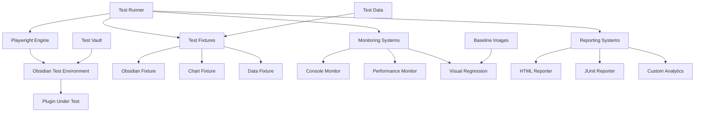
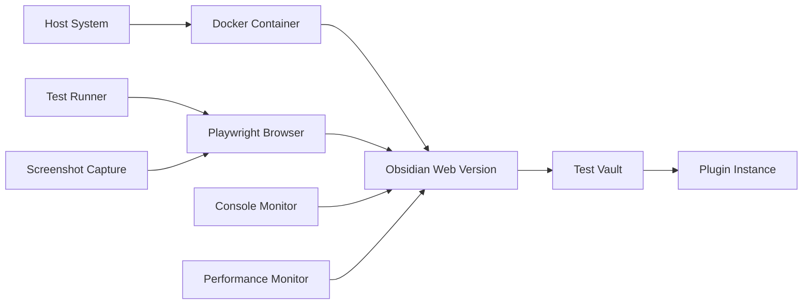

# Design Document

## Overview

This design outlines a comprehensive testing and debugging framework for the Bases Charts Obsidian plugin using modern E2E testing tools. The framework leverages Playwright for browser automation, implements custom fixtures for Obsidian-specific testing, provides automated console monitoring and issue detection, and includes visual regression testing capabilities. The system is designed to run both locally for development and in CI/CD pipelines for automated quality assurance.

## Architecture

### High-Level Architecture



### Testing Environment Architecture



## Components and Interfaces

### Core Testing Framework

#### 1. Playwright Configuration

```typescript
// playwright.config.ts
import { defineConfig, devices } from '@playwright/test';

export default defineConfig({
  testDir: './e2e',
  fullyParallel: true,
  forbidOnly: !!process.env.CI,
  retries: process.env.CI ? 2 : 0,
  workers: process.env.CI ? 1 : undefined,
  
  reporter: [
    ['html', { outputFolder: 'test-results/html-report' }],
    ['junit', { outputFile: 'test-results/junit.xml' }],
    ['./src/reporters/obsidian-reporter.ts']
  ],
  
  use: {
    baseURL: 'http://localhost:8080',
    trace: 'on-first-retry',
    screenshot: 'only-on-failure',
    video: 'retain-on-failure',
  },
  
  projects: [
    {
      name: 'chromium',
      use: { ...devices['Desktop Chrome'] },
    },
    {
      name: 'webkit',
      use: { ...devices['Desktop Safari'] },
    },
  ],
  
  webServer: {
    command: 'npm run test:server',
    url: 'http://localhost:8080',
    reuseExistingServer: !process.env.CI,
    timeout: 120 * 1000,
  },
});
```

#### 2. Custom Test Fixtures

```typescript
// fixtures/obsidian-fixtures.ts
import { test as base, Page } from '@playwright/test';
import { ObsidianTestEnvironment } from './obsidian-environment';
import { ChartTestHelper } from './chart-helper';
import { ConsoleMonitor } from './console-monitor';

type ObsidianFixtures = {
  obsidianEnv: ObsidianTestEnvironment;
  chartHelper: ChartTestHelper;
  consoleMonitor: ConsoleMonitor;
};

export const test = base.extend<ObsidianFixtures>({
  obsidianEnv: async ({ page }, use) => {
    const env = new ObsidianTestEnvironment(page);
    await env.setup();
    await use(env);
    await env.cleanup();
  },
  
  chartHelper: async ({ obsidianEnv }, use) => {
    const helper = new ChartTestHelper(obsidianEnv);
    await use(helper);
  },
  
  consoleMonitor: async ({ page }, use) => {
    const monitor = new ConsoleMonitor(page);
    await monitor.start();
    await use(monitor);
    await monitor.stop();
  },
});

export { expect } from '@playwright/test';
```

#### 3. Obsidian Test Environment

```typescript
// fixtures/obsidian-environment.ts
export class ObsidianTestEnvironment {
  constructor(private page: Page) {}
  
  async setup(): Promise<void> {
    // Navigate to Obsidian web version
    await this.page.goto('/');
    
    // Wait for Obsidian to load
    await this.page.waitForSelector('.app-container', { timeout: 30000 });
    
    // Open test vault
    await this.openTestVault();
    
    // Enable plugin
    await this.enablePlugin();
    
    // Wait for plugin to initialize
    await this.waitForPluginReady();
  }
  
  async openTestVault(): Promise<void> {
    // Implementation for opening test vault
    await this.page.click('[data-testid="open-vault"]');
    await this.page.click('[data-testid="test-vault"]');
    await this.page.waitForSelector('.workspace-leaf-content');
  }
  
  async enablePlugin(): Promise<void> {
    // Navigate to plugin settings
    await this.page.click('[data-testid="settings"]');
    await this.page.click('[data-testid="community-plugins"]');
    
    // Enable Bases Charts plugin
    await this.page.click('[data-testid="bases-charts-toggle"]');
    await this.page.waitForSelector('[data-testid="bases-charts-enabled"]');
    
    // Close settings
    await this.page.keyboard.press('Escape');
  }
  
  async waitForPluginReady(): Promise<void> {
    // Wait for plugin to register views
    await this.page.waitForFunction(() => {
      return window.app?.plugins?.plugins?.['bases-charts']?.enabled === true;
    });
  }
  
  async createBase(name: string, data: any[]): Promise<void> {
    // Create a new base with test data
    await this.page.click('[data-testid="new-base"]');
    await this.page.fill('[data-testid="base-name"]', name);
    
    // Import test data
    await this.importData(data);
    
    await this.page.click('[data-testid="create-base"]');
  }
  
  async openChartView(type: 'scatter' | 'line' | 'bar'): Promise<void> {
    await this.page.click(`[data-testid="chart-view-${type}"]`);
    await this.page.waitForSelector('.chart-container');
  }
  
  async cleanup(): Promise<void> {
    // Clean up test data and state
    await this.clearTestBases();
  }
  
  private async importData(data: any[]): Promise<void> {
    // Implementation for importing test data
  }
  
  private async clearTestBases(): Promise<void> {
    // Implementation for cleaning up test bases
  }
}
```

#### 4. Chart Test Helper

```typescript
// fixtures/chart-helper.ts
export class ChartTestHelper {
  constructor(private obsidianEnv: ObsidianTestEnvironment) {}
  
  async createScatterChart(data: ChartData): Promise<void> {
    await this.obsidianEnv.createBase('test-scatter', data.entries);
    await this.obsidianEnv.openChartView('scatter');
    await this.waitForChartRender();
  }
  
  async createLineChart(data: ChartData): Promise<void> {
    await this.obsidianEnv.createBase('test-line', data.entries);
    await this.obsidianEnv.openChartView('line');
    await this.waitForChartRender();
  }
  
  async createBarChart(data: ChartData): Promise<void> {
    await this.obsidianEnv.createBase('test-bar', data.entries);
    await this.obsidianEnv.openChartView('bar');
    await this.waitForChartRender();
  }
  
  async waitForChartRender(): Promise<void> {
    // Wait for ECharts to render
    await this.obsidianEnv.page.waitForFunction(() => {
      const chartContainer = document.querySelector('.chart-container canvas');
      return chartContainer && chartContainer.width > 0 && chartContainer.height > 0;
    });
  }
  
  async openConfigurationPanel(): Promise<void> {
    await this.obsidianEnv.page.click('[data-testid="config-panel-toggle"]');
    await this.obsidianEnv.page.waitForSelector('.configuration-panel');
  }
  
  async updateConfiguration(config: Partial<ChartConfig>): Promise<void> {
    await this.openConfigurationPanel();
    
    for (const [key, value] of Object.entries(config)) {
      await this.updateConfigField(key, value);
    }
    
    // Wait for chart to update
    await this.waitForChartRender();
  }
  
  async clickDataPoint(index: number): Promise<void> {
    // Click on a specific data point
    const canvas = this.obsidianEnv.page.locator('.chart-container canvas');
    const boundingBox = await canvas.boundingBox();
    
    if (boundingBox) {
      // Calculate click position based on data point
      const clickX = boundingBox.x + (boundingBox.width * 0.3) + (index * 20);
      const clickY = boundingBox.y + (boundingBox.height * 0.7);
      
      await this.obsidianEnv.page.mouse.click(clickX, clickY);
    }
  }
  
  async testChartInteractions(): Promise<void> {
    const canvas = this.obsidianEnv.page.locator('.chart-container canvas');
    
    // Test hover
    await canvas.hover();
    
    // Test zoom
    await canvas.click({ button: 'right' });
    
    // Test pan
    await canvas.dragTo(canvas, {
      sourcePosition: { x: 100, y: 100 },
      targetPosition: { x: 150, y: 150 }
    });
  }
  
  private async updateConfigField(key: string, value: any): Promise<void> {
    // Implementation for updating specific config fields
  }
}
```

### Console Monitoring System

#### 1. Console Monitor

```typescript
// fixtures/console-monitor.ts
export class ConsoleMonitor {
  private messages: ConsoleMessage[] = [];
  private errorPatterns: RegExp[] = [];
  
  constructor(private page: Page) {
    this.setupErrorPatterns();
  }
  
  async start(): Promise<void> {
    this.page.on('console', this.handleConsoleMessage.bind(this));
    this.page.on('pageerror', this.handlePageError.bind(this));
  }
  
  async stop(): Promise<void> {
    this.page.off('console', this.handleConsoleMessage.bind(this));
    this.page.off('pageerror', this.handlePageError.bind(this));
  }
  
  private handleConsoleMessage(msg: ConsoleMessage): void {
    const message = {
      type: msg.type(),
      text: msg.text(),
      location: msg.location(),
      timestamp: new Date(),
    };
    
    this.messages.push(message);
    
    // Check for known error patterns
    this.analyzeMessage(message);
  }
  
  private handlePageError(error: Error): void {
    const message = {
      type: 'error',
      text: error.message,
      stack: error.stack,
      timestamp: new Date(),
    };
    
    this.messages.push(message);
    this.analyzeMessage(message);
  }
  
  private setupErrorPatterns(): void {
    this.errorPatterns = [
      /UnifaceChart.*not.*defined/i,
      /ChartPanel.*failed.*to.*mount/i,
      /ECharts.*initialization.*failed/i,
      /Svelte.*component.*error/i,
      /Configuration.*panel.*error/i,
      /Failed.*to.*load.*plugin/i,
      /TypeError.*Cannot.*read.*property/i,
      /ReferenceError.*is.*not.*defined/i,
    ];
  }
  
  private analyzeMessage(message: any): void {
    for (const pattern of this.errorPatterns) {
      if (pattern.test(message.text)) {
        this.flagCriticalError(message, pattern);
      }
    }
  }
  
  private flagCriticalError(message: any, pattern: RegExp): void {
    console.error(`Critical error detected: ${message.text}`);
    // Add to critical errors list for reporting
  }
  
  getErrors(): ConsoleMessage[] {
    return this.messages.filter(msg => msg.type === 'error');
  }
  
  getWarnings(): ConsoleMessage[] {
    return this.messages.filter(msg => msg.type === 'warning');
  }
  
  getCriticalErrors(): ConsoleMessage[] {
    return this.messages.filter(msg => 
      this.errorPatterns.some(pattern => pattern.test(msg.text))
    );
  }
  
  generateReport(): ConsoleReport {
    return {
      totalMessages: this.messages.length,
      errors: this.getErrors(),
      warnings: this.getWarnings(),
      criticalErrors: this.getCriticalErrors(),
      summary: this.generateSummary(),
    };
  }
  
  private generateSummary(): string {
    const errors = this.getErrors().length;
    const warnings = this.getWarnings().length;
    const critical = this.getCriticalErrors().length;
    
    return `Console Summary: ${errors} errors, ${warnings} warnings, ${critical} critical issues`;
  }
}
```

### Visual Regression Testing

#### 1. Visual Testing Helper

```typescript
// fixtures/visual-testing.ts
export class VisualTestingHelper {
  constructor(private page: Page) {}
  
  async captureChartScreenshot(name: string, options?: ScreenshotOptions): Promise<void> {
    const chartContainer = this.page.locator('.chart-container');
    await chartContainer.screenshot({
      path: `test-results/screenshots/${name}.png`,
      ...options
    });
  }
  
  async compareWithBaseline(name: string): Promise<boolean> {
    const chartContainer = this.page.locator('.chart-container');
    
    try {
      await expect(chartContainer).toHaveScreenshot(`${name}-baseline.png`, {
        maxDiffPixels: 100,
        threshold: 0.2,
      });
      return true;
    } catch (error) {
      console.error(`Visual regression detected for ${name}:`, error);
      return false;
    }
  }
  
  async captureConfigPanelScreenshot(name: string): Promise<void> {
    const panel = this.page.locator('.configuration-panel');
    await panel.screenshot({
      path: `test-results/screenshots/panel-${name}.png`
    });
  }
  
  async testResponsiveDesign(): Promise<void> {
    const viewports = [
      { width: 1920, height: 1080, name: 'desktop' },
      { width: 1024, height: 768, name: 'tablet' },
      { width: 375, height: 667, name: 'mobile' },
    ];
    
    for (const viewport of viewports) {
      await this.page.setViewportSize(viewport);
      await this.captureChartScreenshot(`responsive-${viewport.name}`);
    }
  }
}
```

### Performance Testing

#### 1. Performance Monitor

```typescript
// fixtures/performance-monitor.ts
export class PerformanceMonitor {
  private metrics: PerformanceMetric[] = [];
  
  constructor(private page: Page) {}
  
  async startMonitoring(): Promise<void> {
    await this.page.addInitScript(() => {
      window.performanceMetrics = [];
      
      // Monitor chart rendering performance
      const originalSetOption = window.echarts?.setOption;
      if (originalSetOption) {
        window.echarts.setOption = function(...args) {
          const start = performance.now();
          const result = originalSetOption.apply(this, args);
          const end = performance.now();
          
          window.performanceMetrics.push({
            type: 'chart-render',
            duration: end - start,
            timestamp: Date.now(),
          });
          
          return result;
        };
      }
    });
  }
  
  async measureChartCreation(): Promise<number> {
    const start = Date.now();
    
    // Wait for chart to be created and rendered
    await this.page.waitForSelector('.chart-container canvas');
    await this.page.waitForFunction(() => {
      const canvas = document.querySelector('.chart-container canvas');
      return canvas && canvas.width > 0 && canvas.height > 0;
    });
    
    const end = Date.now();
    return end - start;
  }
  
  async measureConfigurationUpdate(): Promise<number> {
    const start = Date.now();
    
    // Trigger configuration update
    await this.page.click('[data-testid="color-primary"]');
    await this.page.fill('[data-testid="color-primary"]', '#ff0000');
    
    // Wait for chart to re-render
    await this.page.waitForTimeout(100); // Allow for debouncing
    
    const end = Date.now();
    return end - start;
  }
  
  async measureMemoryUsage(): Promise<MemoryInfo> {
    return await this.page.evaluate(() => {
      if ('memory' in performance) {
        return (performance as any).memory;
      }
      return null;
    });
  }
  
  async detectMemoryLeaks(): Promise<boolean> {
    const initialMemory = await this.measureMemoryUsage();
    
    // Perform operations that might cause memory leaks
    for (let i = 0; i < 10; i++) {
      await this.page.reload();
      await this.page.waitForSelector('.chart-container');
    }
    
    const finalMemory = await this.measureMemoryUsage();
    
    if (initialMemory && finalMemory) {
      const memoryIncrease = finalMemory.usedJSHeapSize - initialMemory.usedJSHeapSize;
      return memoryIncrease > 10 * 1024 * 1024; // 10MB threshold
    }
    
    return false;
  }
  
  generatePerformanceReport(): PerformanceReport {
    return {
      metrics: this.metrics,
      summary: this.generateSummary(),
      recommendations: this.generateRecommendations(),
    };
  }
  
  private generateSummary(): string {
    // Generate performance summary
    return 'Performance analysis complete';
  }
  
  private generateRecommendations(): string[] {
    // Generate performance recommendations
    return [];
  }
}
```

## Data Models

### Test Data Structures

```typescript
interface ChartData {
  entries: Array<{
    x: number | string | Date;
    y: number;
    file?: string;
    [key: string]: any;
  }>;
  metadata: {
    xAxisType: 'value' | 'category' | 'time';
    yAxisType: 'value' | 'category';
    title?: string;
  };
}

interface TestScenario {
  name: string;
  description: string;
  data: ChartData;
  config?: Partial<ChartConfig>;
  expectedBehavior: string[];
  skipConditions?: string[];
}

interface ConsoleMessage {
  type: 'log' | 'info' | 'warn' | 'error' | 'debug';
  text: string;
  location?: {
    url: string;
    lineNumber: number;
    columnNumber: number;
  };
  timestamp: Date;
  stack?: string;
}

interface PerformanceMetric {
  type: string;
  duration: number;
  timestamp: number;
  metadata?: any;
}

interface TestResult {
  testName: string;
  status: 'passed' | 'failed' | 'skipped';
  duration: number;
  errors: string[];
  warnings: string[];
  screenshots: string[];
  consoleReport: ConsoleReport;
  performanceReport?: PerformanceReport;
}
```

## Error Handling

### Error Detection Patterns

```typescript
interface ErrorPattern {
  pattern: RegExp;
  severity: 'critical' | 'high' | 'medium' | 'low';
  category: 'plugin' | 'echarts' | 'svelte' | 'obsidian' | 'wrapper';
  description: string;
  suggestedFix: string;
}

const ERROR_PATTERNS: ErrorPattern[] = [
  {
    pattern: /UnifaceChart.*is.*not.*a.*constructor/i,
    severity: 'critical',
    category: 'wrapper',
    description: 'UnifaceChart wrapper not properly imported or initialized',
    suggestedFix: 'Check @ticatec/uniface-echarts import and installation'
  },
  {
    pattern: /ChartPanel.*failed.*to.*mount/i,
    severity: 'critical',
    category: 'svelte',
    description: 'Svelte ChartPanel component failed to mount',
    suggestedFix: 'Check Svelte component structure and props'
  },
  {
    pattern: /ECharts.*is.*not.*defined/i,
    severity: 'critical',
    category: 'echarts',
    description: 'ECharts library not loaded or accessible',
    suggestedFix: 'Verify ECharts dependency and import'
  },
  {
    pattern: /Cannot.*read.*property.*'invalidate'/i,
    severity: 'high',
    category: 'wrapper',
    description: 'Chart instance not properly initialized before calling invalidate',
    suggestedFix: 'Ensure chart is created before calling wrapper methods'
  },
];
```

### Automated Issue Detection

```typescript
export class IssueDetector {
  private patterns: ErrorPattern[] = ERROR_PATTERNS;
  
  analyzeConsoleMessages(messages: ConsoleMessage[]): DetectedIssue[] {
    const issues: DetectedIssue[] = [];
    
    for (const message of messages) {
      for (const pattern of this.patterns) {
        if (pattern.pattern.test(message.text)) {
          issues.push({
            message: message.text,
            pattern: pattern,
            timestamp: message.timestamp,
            location: message.location,
            suggestedFix: pattern.suggestedFix,
          });
        }
      }
    }
    
    return issues;
  }
  
  generateFixSuggestions(issues: DetectedIssue[]): FixSuggestion[] {
    const suggestions: FixSuggestion[] = [];
    
    // Group issues by category
    const groupedIssues = this.groupIssuesByCategory(issues);
    
    for (const [category, categoryIssues] of groupedIssues) {
      suggestions.push({
        category,
        priority: this.calculatePriority(categoryIssues),
        fixes: categoryIssues.map(issue => issue.suggestedFix),
        affectedTests: this.getAffectedTests(categoryIssues),
      });
    }
    
    return suggestions;
  }
  
  private groupIssuesByCategory(issues: DetectedIssue[]): Map<string, DetectedIssue[]> {
    const groups = new Map<string, DetectedIssue[]>();
    
    for (const issue of issues) {
      const category = issue.pattern.category;
      if (!groups.has(category)) {
        groups.set(category, []);
      }
      groups.get(category)!.push(issue);
    }
    
    return groups;
  }
  
  private calculatePriority(issues: DetectedIssue[]): 'critical' | 'high' | 'medium' | 'low' {
    const severities = issues.map(issue => issue.pattern.severity);
    
    if (severities.includes('critical')) return 'critical';
    if (severities.includes('high')) return 'high';
    if (severities.includes('medium')) return 'medium';
    return 'low';
  }
  
  private getAffectedTests(issues: DetectedIssue[]): string[] {
    // Implementation to identify which tests are affected by these issues
    return [];
  }
}
```

## Testing Strategy

### Test Categories

#### 1. Smoke Tests
- Plugin loads without errors
- Basic chart creation works
- Configuration panel opens

#### 2. Functional Tests
- Chart rendering with different data types
- Configuration updates and persistence
- Chart interactions (click, hover, zoom)
- File navigation integration

#### 3. Integration Tests
- Obsidian bases system integration
- Plugin lifecycle management
- Multi-chart scenarios

#### 4. Performance Tests
- Large dataset handling
- Memory usage monitoring
- Rendering performance benchmarks

#### 5. Visual Regression Tests
- Chart appearance consistency
- Configuration panel layout
- Responsive design validation

#### 6. Error Handling Tests
- Invalid data scenarios
- Network failures
- Plugin conflicts

### Test Data Management

```typescript
export class TestDataManager {
  private static readonly DATA_SETS = {
    small: { size: 10, type: 'numeric' },
    medium: { size: 100, type: 'mixed' },
    large: { size: 1000, type: 'time-series' },
    edge: { size: 5, type: 'edge-cases' },
  };
  
  static generateScatterData(size: number): ChartData {
    const entries = [];
    for (let i = 0; i < size; i++) {
      entries.push({
        x: Math.random() * 100,
        y: Math.random() * 100,
        file: `test-file-${i}.md`,
      });
    }
    
    return {
      entries,
      metadata: {
        xAxisType: 'value',
        yAxisType: 'value',
        title: `Scatter Data (${size} points)`,
      },
    };
  }
  
  static generateTimeSeriesData(size: number): ChartData {
    const entries = [];
    const startDate = new Date('2023-01-01');
    
    for (let i = 0; i < size; i++) {
      const date = new Date(startDate);
      date.setDate(date.getDate() + i);
      
      entries.push({
        x: date,
        y: Math.sin(i * 0.1) * 50 + Math.random() * 20,
        file: `daily-note-${i}.md`,
      });
    }
    
    return {
      entries,
      metadata: {
        xAxisType: 'time',
        yAxisType: 'value',
        title: `Time Series Data (${size} points)`,
      },
    };
  }
  
  static generateCategoricalData(categories: string[]): ChartData {
    const entries = categories.map(category => ({
      x: category,
      y: Math.floor(Math.random() * 100) + 1,
      file: `${category.toLowerCase()}.md`,
    }));
    
    return {
      entries,
      metadata: {
        xAxisType: 'category',
        yAxisType: 'value',
        title: 'Categorical Data',
      },
    };
  }
  
  static generateEdgeCaseData(): ChartData {
    return {
      entries: [
        { x: 0, y: 0, file: 'zero.md' },
        { x: Number.MAX_SAFE_INTEGER, y: 1, file: 'max.md' },
        { x: -Number.MAX_SAFE_INTEGER, y: -1, file: 'min.md' },
        { x: 1, y: Number.MAX_SAFE_INTEGER, file: 'max-y.md' },
        { x: 2, y: -Number.MAX_SAFE_INTEGER, file: 'min-y.md' },
      ],
      metadata: {
        xAxisType: 'value',
        yAxisType: 'value',
        title: 'Edge Case Data',
      },
    };
  }
}
```

## Implementation Phases

### Phase 1: Core Testing Infrastructure
1. Set up Playwright configuration and basic fixtures
2. Implement Obsidian test environment setup
3. Create console monitoring system
4. Build basic test data management

### Phase 2: Chart Testing Framework
1. Implement chart-specific test helpers
2. Create visual regression testing capabilities
3. Build performance monitoring system
4. Add automated issue detection

### Phase 3: Advanced Testing Features
1. Implement comprehensive error pattern detection
2. Add performance benchmarking and regression detection
3. Create advanced reporting and analytics
4. Build CI/CD integration

### Phase 4: Testing Optimization
1. Optimize test execution speed and reliability
2. Add parallel test execution capabilities
3. Implement test result caching and incremental testing
4. Create comprehensive documentation and examples

## Technology Stack

### Core Testing Tools
- **Playwright**: Browser automation and E2E testing
- **TypeScript**: Type-safe test development
- **Node.js**: Test runner environment

### Monitoring and Analysis
- **Custom Console Monitor**: Real-time console analysis
- **Performance API**: Browser performance monitoring
- **Image Comparison**: Visual regression detection

### Reporting and CI/CD
- **HTML Reporter**: Rich test result visualization
- **JUnit Reporter**: CI/CD integration
- **GitHub Actions**: Automated test execution
- **Docker**: Consistent test environments

### Development Tools
- **ESLint**: Test code quality
- **Prettier**: Code formatting
- **Bun**: Fast package management and test execution